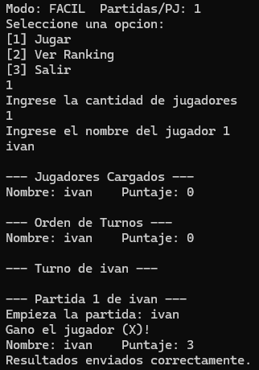
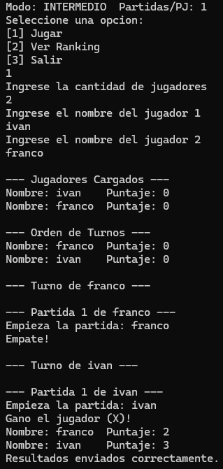
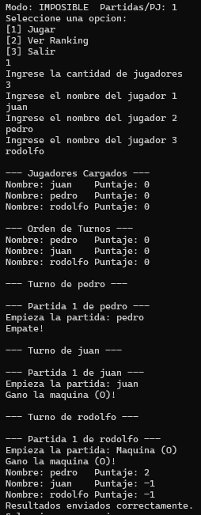
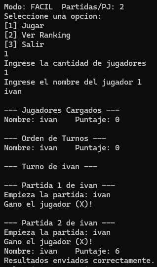
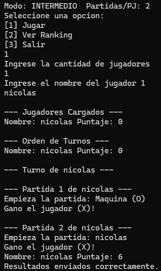
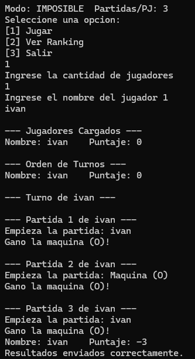
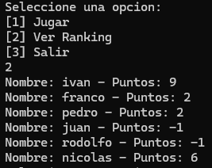
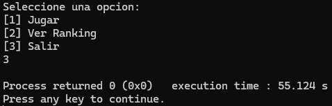

**Repositorio para realizar el TP de Algoritmos y Estructuras de Datos**

---

## Nombre del equipo
**primo**

## Integrantes
- Ivan Nicolas Roig  
- Felipe Pedro Devalle  
- Lautaro Garat  

---

## Descripción
Creamos el juego TaCeTi (tateti) contra la computadora, el cual posee 3 dificultades  
**Facil** (siempre gana el usuario), **Intermedio** (la computadora selecciona una casilla aleatoria)  
e **Imposible** (utilizando el algoritmo MiniMax).  
Este programa está conectado con una API, la cual muestra y guarda un ranking en el  
que se muestra el nombre de los jugadores y sus puntos.  
Utilizamos **SDL2** para la interfaz gráfica del juego (tablero), **CURL** para el manejo  
de la API y la librería **cJSON** para poder formatear los datos.

---

## Instalación
Lo que se debe hacer para que el programa funcione correctamente es abrir el proyecto y  
seguir estas instrucciones:

1. Ir a **Settings → Compiler**
2. En la pestaña **"Search directories"** hacer lo siguiente:
   - **Compiler** → clic en **Add** → agregar la ruta a la carpeta **include** de libcurl  
     (dicha carpeta se encuentra en el proyecto)
   - **Linker** → clic en **Add** → agregar la ruta a la carpeta **lib** de libcurl
3. En la pestaña **"Linker settings"**:
   - Hacer clic en **Add** en el campo de librerías  
     Escribir: `curl`

**Nombre de carpeta:** `curl-8.7.1_2-win64-mingw`

---

## Juego
Una vez inicializado el juego, se abren dos ventanas, la consola y el juego en SDL2.  
Desde la consola se puede visualizar un menú en el cual tenemos 3 opciones:

1. **Jugar** (presionar `1`)  
   - Indicar la cantidad de jugadores  
   - Ingresar el nombre de cada uno  
   - El programa mostrará el orden de los jugadores  
   - En la ventana SDL2 se mostrará el tablero para jugar  
2. **Ver Ranking**  
3. **Salir**

Una vez todos hayan terminado, se envían los datos a la API y se crea un informe de las partidas.

---
## Lotes de Prueba
| Descripción                                                             | Salida esperada                                                                                                 | Salida obtenida                                              |
|-------------------------------------------------------------------------|-----------------------------------------------------------------------------------------------------------------|--------------------------------------------------------------|
| 1. Modo FACIL, partidas=1, 1 jugador (ivan, gana, obtiene 3 puntos)                   | “Gano el jugador (X)!”                                                                                         |                               |
| 2. Modo INTERMEDIO, partidas=1, 2 jugadores (franco, empata, obtiene 2 puntos) (ivan, gana, obtiene 3 puntos)               | “Empate!” “Gano el jugador (X)!”                                                                              |                               |
| 3. Modo IMPOSIBLE, partidas=1, 3 jugadores (pedro, empata, gana 2 puntos) (juan, pierde, pierde 1 punto) (rodolfo, pierde, pierde 1 punto)            | “Empate!” “Gano la maquina (O)!” “Gano la maquina (O)!”                                                    |                               |
| 4. Modo FACIL, partidas=2, 1 jugador (ivan, gana, obtiene 3 puntos) (ivan, gana, obtiene 3 puntos)              | “Gano el jugador (X)!” “Gano el jugador (X)!”                                                                |                               |
| 5. Modo INTERMEDIO, partidas=2, 1 jugador (nicolas, gana, obtiene 3 puntos) (nicolas, gana, obtiene 3 puntos) | “Gano el jugador (X)!” “Gano el jugador (X)!”                                                                |                               |
| 6. Modo IMPOSIBLE, partidas=3, 1 jugador (ivan, pierde, pierde 1 punto) (ivan, pierde, pierde 1 punto) (ivan, pierde, pierde 1 punto)       | “Gano la maquina (O)!” “Gano la maquina (O)!” “Gano la maquina (O)!”                                      |                               |
| 7. Seleccionar opción 2 (Ver Ranking)                                   | Listado de “Nombre: … – Puntos: …” según datos guardados en la API                                               |                               |
| 8. Seleccionar opción 3 (Salir)                                         | El programa termina sin errores (código 0; ventana y consola se cierran)                                        |                               |
